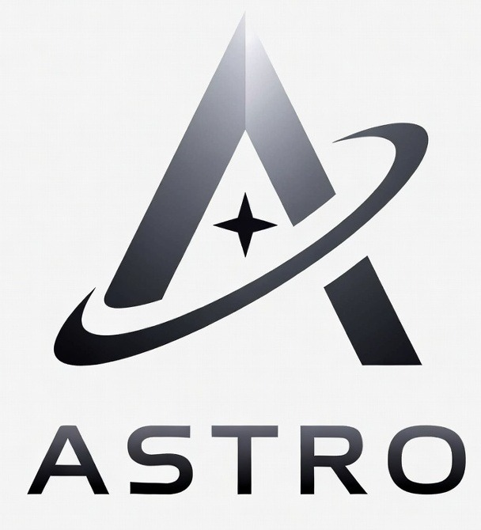

[![Support][support-badge]][support-url]
[![DOI][doi-badge-imgshield]][doi-url]
[![License][license-badge]][license-url]
[![Docker image tag][docker-image-tag-badge]][docker-image-url]
[![Docker pulls][docker-image-pull-badge]][docker-image-url]
[![Docker Stars][docker-image-stars-badge]][docker-image-url]
[![GitLab][gitlab-tag-badge]][gitlab-url]

[doi-badge-zenodo]: https://zenodo.org/badge/DOI/10.5281/zenodo.16760961.svg
[doi-badge-imgshield]: https://img.shields.io/badge/DOI-10.5281%20%2F%20zenodo.16760961-blue.svg?style=for-the-badge&logo=doi
[doi-url]: https://doi.org/10.5281/zenodo.16760961

[docker-image-tag-badge]: https://img.shields.io/docker/v/mayanedms/mayanedms?style=for-the-badge&sort=semver&logo=docker

[docker-image-url]: https://hub.docker.com/r/mayanedms/mayanedms

[docker-image-pull-badge]: https://img.shields.io/docker/pulls/mayanedms/mayanedms.svg?style=for-the-badge&logo=docker

[docker-image-stars-badge]: https://img.shields.io/docker/stars/mayanedms/mayanedms.svg?style=for-the-badge&logo=docker

[gitlab-pipelines-url]: https://gitlab.com/mayan-edms/mayan-edms/pipelines
[gitlab-tag-badge]:https://img.shields.io/gitlab/v/tag/mayan-edms%2Fmayan-edms?style=for-the-badge&sort=semver&logo=gitlab&label=GitLab
[gitlab-url]: https://gitlab.com/mayan-edms/mayan-edms

[pypi-badge]: https://img.shields.io/pypi/v/mayan-edms?style=for-the-badge&logo=python&label=PyPI
[pypi-url]: https://pypi.org/project/mayan-edms/

[license-badge]: https://img.shields.io/pypi/l/mayan-edms.svg?style=for-the-badge&logo=opensourceinitiative&logoColor=white&color=008800
[license-url]: https://gitlab.com/mayan-edms/mayan-edms/blob/master/LICENSE

[support-badge]: https://img.shields.io/badge/Get_support-brightgreen?style=for-the-badge
[support-url]: https://www.mayan-edms.com/support/

    The most advanced, scalable, and mature open source document management system based on the Mayan EDMS.

# Astro-edms

